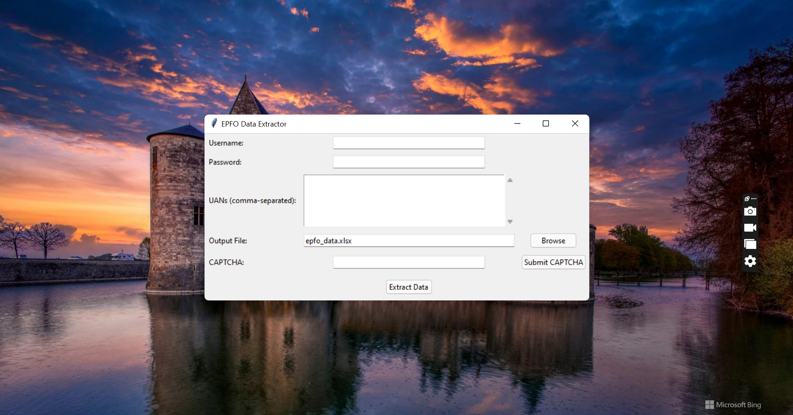

# EPFO Data Extractor Script

  <!-- Replace application_screenshot.png with your actual image file name -->

## Description

This Python script extracts data from the EPFO portal. It automates login, handles manual CAPTCHA, navigates to member search, and retrieves member details (Name, Joining Date, Exit Date) for a list of UANs. Data is saved to an Excel (`.xlsx`) file.

**Manual CAPTCHA entry is required during login.**

## Features

* **Automated EPFO Login:** Script-based login to the EPFO portal.
* **Manual CAPTCHA Handling:** User solves CAPTCHA in browser, enters in script.
* **UAN Data Extraction:** Retrieves Name, Joining Date, and Exit Date for provided UANs.
* **Excel Output:** Saves data to an organized `.xlsx` file.
* **GUI Input:** Simple Tkinter interface for credentials, UANs, and output file.
* **Logging:**  Basic logging to `epfo_scraper.log`.

## How to Run

1. **Install Dependencies:** Ensure you have Python installed and install required libraries using pip:
   ```bash
   pip install playwright pandas openpyxl
   playwright install chromium  # Install browser for Playwright
